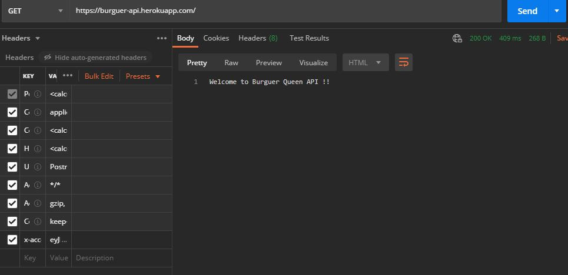
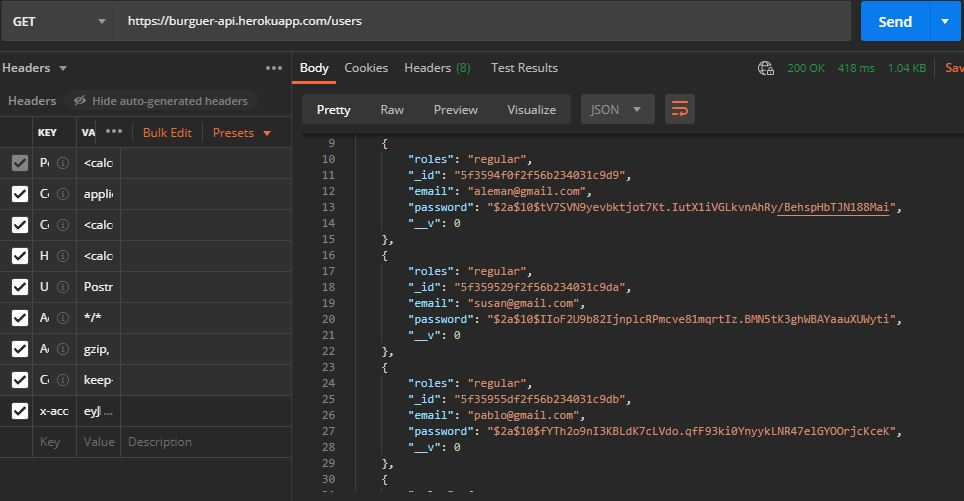
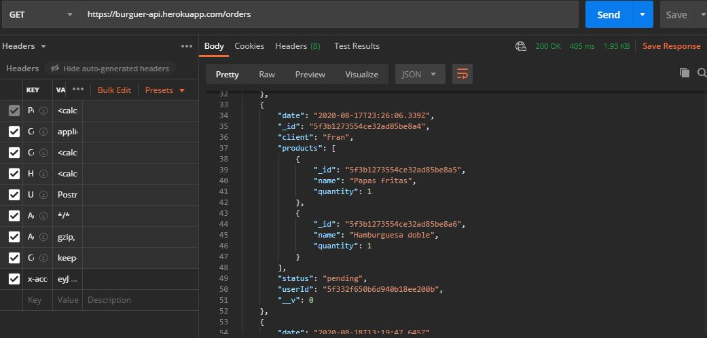

# Burger Queen - API con Node.js
API REST para un pequeño restaurante el cual necesita una aplicación para mantener el orden respecto a las ordenes realizadas.

## Funcionalidades
* El usuario puede navegar entre los diferentes [endpoints](https://laboratoria.github.io/burger-queen-api/) unicamente si cuenta con un token de seguridad que se le brinda en el momento que se autentica como usuario registrado.
* Existen dos tipos de roles: regular y administrador, el cual se verifica con el correo y password del administrador, por lo que el usuario con un rol regular tendrá acceso solo a algunos de los métodos que brinda la aplicación.

## Herramientas 

* JavaScript
* Node JS
* Express
* Mongoose
* MongoDB
* Postman
* Variables de entorno
* JSON Web Tokens
* Heroku

### API

###  `/`

* `GET /`

###  `/auth`

* `POST /auth`

###  `/users`

* `GET /users`
* `GET /users/:uid`
* `POST /users`
* `PUT /users/:uid`
* `DELETE /users/:uid`

### `/products`

* `GET /products`
* `GET /products/:productid`
* `POST /products`
* `PUT /products/:productid`
* `DELETE /products/:productid`

### `/orders`

* `GET /orders`
* `GET /orders/:orderId`
* `POST /orders`
* `PUT /orders/:orderId`
* `DELETE /orders/:orderId`

## Deployment
El deployment de la aplicación se realizó en [Heroku](www.heroku.com) y puedes tener acceso a la API en este [link](https://burguer-api.herokuapp.com/). 

